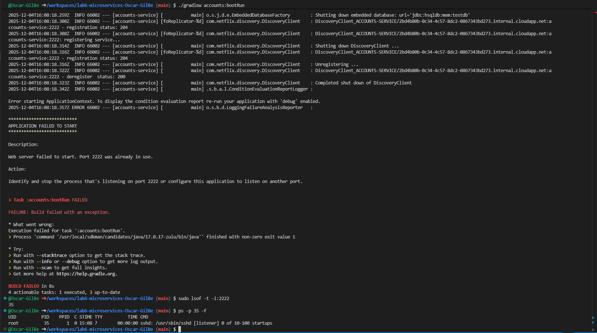
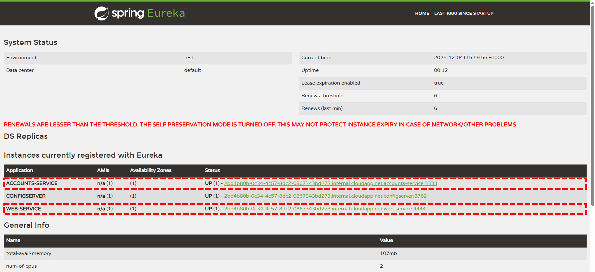
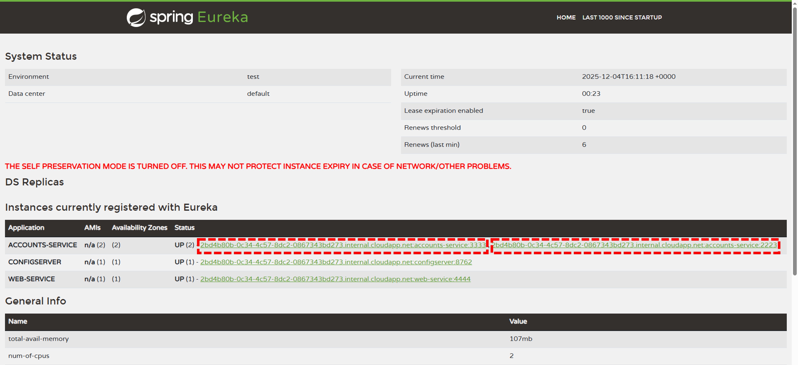
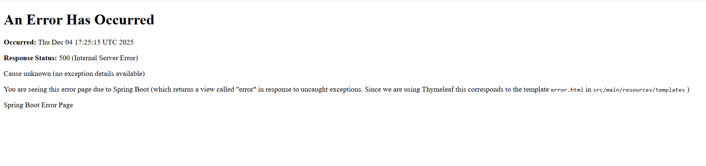
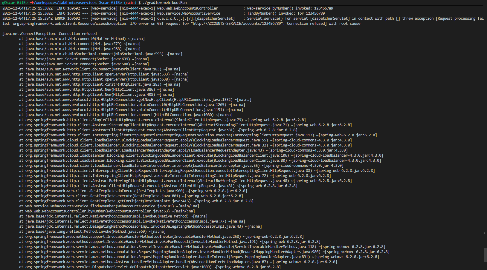
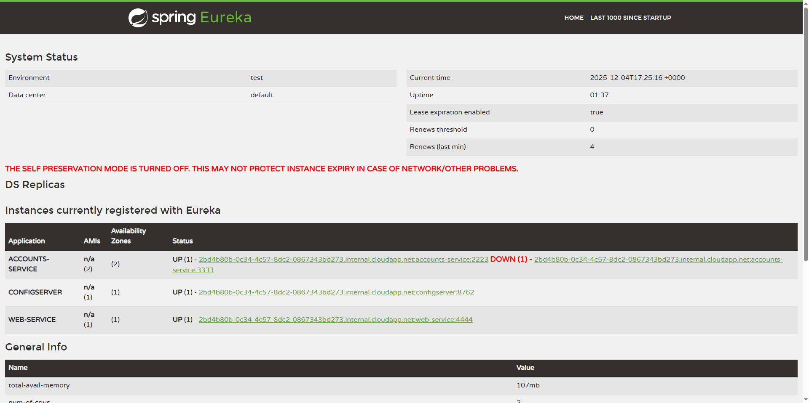
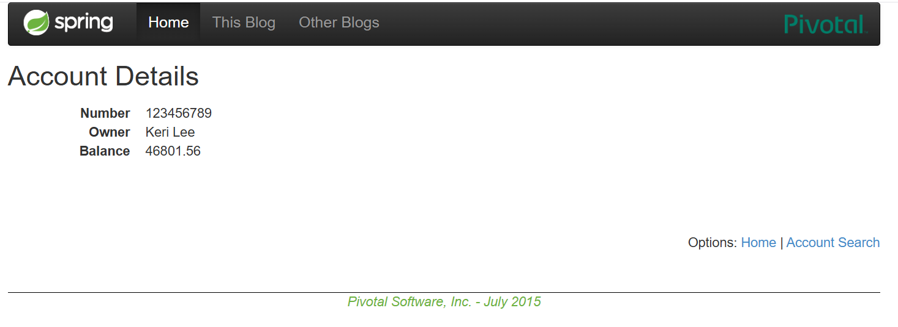
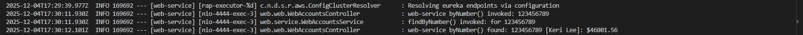
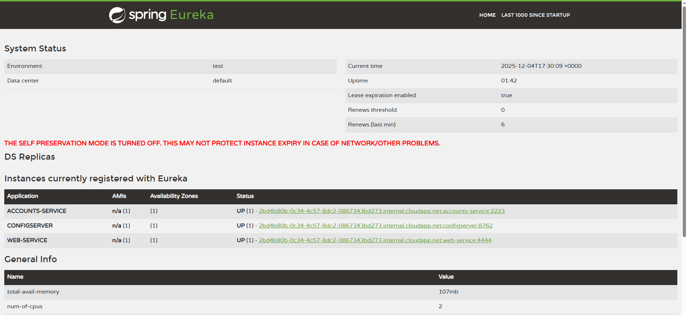

# Lab 6 Microservices - Project Report

## 1. Configuration Setup

**Configuration Repository**: [lab6-microservices-Oscar-GilBe](https://github.com/Oscar-GilBe/lab6-microservices-Oscar-GilBe/)

### Configuration modifications in `accounts-service.yml`

The primary modification made to the `accounts-service.yml` configuration file involved changing the **server port** where the accounts service launches. Originally, the service was configured to run on port 3333, but this was modified to port 2222 to meet the goals of Task 3 (Update Configuration) in the lab exercise. The change was straightforward, updating the `server.port` property from 3333 to **2222** in the YAML configuration file. This demonstrates the flexibility of externalized configuration, where such changes can be made without modifying the application's source code or requiring recompilation of the service.

> [!CAUTION]
> It's worth noting that in GitHub Codespaces, port 2222 was already in use by another process. Therefore, we had to change the accounts-service port to **2223** to avoid startup errors. As a result, the screenshots and logs show port 2223 instead of the originally configured port 2222.

Error encountered when port 2222 was already in use:


### Why is externalized configuration useful in microservices?

Externalized configuration is a fundamental practice in microservices architecture that provides significant advantages for application deployment and maintenance. By separating configuration from the application code, **services can be configured dynamically** without requiring rebuilding or redeploying the entire application. This approach is particularly valuable in microservices environments where multiple instances of the same service may run simultaneously across different environments such as development, staging, and production.

Centralizing configuration through a dedicated config server, as implemented in this lab with Spring Cloud Config, makes it considerably **easier to scale services and modify settings across the entire system**. When configuration changes are needed, they can be applied **centrally** and propagated to all service instances without individual updates to each deployment. This centralization significantly **reduces the risk of inconsistencies** that could arise from manually managing configuration across multiple service instances and environments.

Furthermore, externalized configuration supports better **security** practices by allowing sensitive information like database credentials or API keys to be managed separately from the codebase. It also facilitates **environment-specific configurations**, enabling the same application artifact to be deployed across different environments with appropriate settings for each context. This **separation of concerns** between code and configuration is essential for maintaining agile and scalable microservices architectures.

---

## 2. Service Registration (Task 1)

### Accounts Service Registration


#### Accounts Service Registration Process

When a Spring Boot microservice starts up, it undergoes several critical initialization phases before becoming discoverable and available to other services in the ecosystem. The service registration process for the accounts service represents the mechanism by which the service identifies itself and announces its availability to the Eureka service registry.

The process begins with **application startup**, where the microservice launches and immediately fetches its configuration from the **_config-server_**. During this phase, the service initializes its application context, including all Spring beans, database connections, and the embedded Tomcat server. At this point, the service is running locally and functional, but it remains invisible to other services in the microservices ecosystem because it hasn't yet registered with the discovery server.

```
2025-12-04T18:38:07.686Z  INFO 264105 --- [accounts-service] [           main] accounts.ApplicationKt                   : Starting ApplicationKt using Java 17.0.17 with PID 264105 (/workspaces/lab6-microservices-Oscar-GilBe/accounts/build/classes/kotlin/main started by codespace in /workspaces/lab6-microservices-Oscar-GilBe/accounts)
2025-12-04T18:38:07.688Z  INFO 264105 --- [accounts-service] [           main] accounts.ApplicationKt                   : No active profile set, falling back to 1 default profile: "default"
2025-12-04T18:38:07.721Z  INFO 264105 --- [accounts-service] [           main] o.s.c.c.c.ConfigServerConfigDataLoader   : Fetching config from server at : http://localhost:8762
2025-12-04T18:38:07.721Z  INFO 264105 --- [accounts-service] [           main] o.s.c.c.c.ConfigServerConfigDataLoader   : Located environment: name=accounts-service, profiles=[default], label=null, version=null, state=null
2025-12-04T18:38:08.797Z  INFO 264105 --- [accounts-service] [           main] .s.d.r.c.RepositoryConfigurationDelegate : Bootstrapping Spring Data JPA repositories in DEFAULT mode.
2025-12-04T18:38:08.906Z  INFO 264105 --- [accounts-service] [           main] .s.d.r.c.RepositoryConfigurationDelegate : Finished Spring Data repository scanning in 102 ms. Found 1 JPA repository interface.
2025-12-04T18:38:09.131Z  INFO 264105 --- [accounts-service] [           main] o.s.cloud.context.scope.GenericScope     : BeanFactory id=e7a61537-c147-3e5e-af75-7c19be8b1d4c
2025-12-04T18:38:09.448Z  INFO 264105 --- [accounts-service] [           main] o.s.b.w.embedded.tomcat.TomcatWebServer  : Tomcat initialized with port 3333 (http)
2025-12-04T18:38:09.459Z  INFO 264105 --- [accounts-service] [           main] o.apache.catalina.core.StandardService   : Starting service [Tomcat]
...
2025-12-04T18:38:09.877Z  INFO 264105 --- [accounts-service] [           main] accounts.config.AccountsWebApplication   : System has 21 accounts
2025-12-04T18:38:09.947Z  INFO 264105 --- [accounts-service] [           main] o.hibernate.jpa.internal.util.LogHelper  : HHH000204: Processing PersistenceUnitInfo [name: default]
2025-12-04T18:38:09.973Z  INFO 264105 --- [accounts-service] [           main] org.hibernate.Version                    : HHH000412: Hibernate ORM core version 6.6.18.Final
2025-12-04T18:38:09.995Z  INFO 264105 --- [accounts-service] [           main] o.h.c.internal.RegionFactoryInitiator    : HHH000026: Second-level cache disabled
...
2025-12-04T18:38:10.758Z  INFO 264105 --- [accounts-service] [           main] j.LocalContainerEntityManagerFactoryBean : Initialized JPA EntityManagerFactory for persistence unit 'default'
2025-12-04T18:38:10.991Z  INFO 264105 --- [accounts-service] [           main] o.s.d.j.r.query.QueryEnhancerFactory     : Hibernate is in classpath; If applicable, HQL parser will be used.
Hibernate: select count(a1_0.id) from t_account a1_0
2025-12-04T18:38:11.533Z  INFO 264105 --- [accounts-service] [           main] accounts.web.AccountsController          : AccountRepository says system has 21 accounts
2025-12-04T18:38:11.566Z  WARN 264105 --- [accounts-service] [           main] JpaBaseConfiguration$JpaWebConfiguration : spring.jpa.open-in-view is enabled by default. Therefore, database queries may be performed during view rendering. Explicitly configure spring.jpa.open-in-view to disable this warning
2025-12-04T18:38:11.584Z  INFO 264105 --- [accounts-service] [           main] o.s.b.a.w.s.WelcomePageHandlerMapping    : Adding welcome page template: index
```

Following the initial startup, **Eureka client initialization** takes place. The Eureka client component within the service activates and begins preparing **metadata** about the service instance. This metadata includes critical information such as the service name, IP address, port number, health status, and available health check endpoints. During this initialization phase, the service's internal status is set to `STARTING`, indicating that while the service is operational, it is not yet healthy or ready to be discovered by other services.

```
2025-12-04T18:38:12.020Z  INFO 264105 --- [accounts-service] [           main] DiscoveryClientOptionalArgsConfiguration : Eureka HTTP Client uses RestTemplate.
2025-12-04T18:38:12.048Z  WARN 264105 --- [accounts-service] [           main] iguration$LoadBalancerCaffeineWarnLogger : Spring Cloud LoadBalancer is currently working with the default cache. While this cache implementation is useful for development and tests, it's recommended to use Caffeine cache in production.You can switch to using Caffeine cache, by adding it and org.springframework.cache.caffeine.CaffeineCacheManager to the classpath.
2025-12-04T18:38:12.053Z  INFO 264105 --- [accounts-service] [           main] o.s.b.a.e.web.EndpointLinksResolver      : Exposing 16 endpoints beneath base path '/actuator'
2025-12-04T18:38:12.107Z  INFO 264105 --- [accounts-service] [           main] o.s.c.n.eureka.InstanceInfoFactory       : Setting initial instance status as: STARTING
```

The next critical step involves **fetching the registry from the Eureka server**. The service contacts the Eureka server (typically running on the default port 8761) and **retrieves the current list of all registered services**. This step ensures that the new service instance is aware of the existing service ecosystem before joining it. A successful connection to Eureka is confirmed by an HTTP 200 status response, indicating that the registry information has been successfully retrieved.

```
2025-12-04T18:38:12.124Z  INFO 264105 --- [accounts-service] [           main] com.netflix.discovery.DiscoveryClient    : Initializing Eureka in region us-east-1
2025-12-04T18:38:12.126Z  INFO 264105 --- [accounts-service] [           main] c.n.d.s.r.aws.ConfigClusterResolver      : Resolving eureka endpoints via configuration
2025-12-04T18:38:12.133Z  INFO 264105 --- [accounts-service] [           main] com.netflix.discovery.DiscoveryClient    : Disable delta property : false
...
2025-12-04T18:38:12.135Z  INFO 264105 --- [accounts-service] [           main] com.netflix.discovery.DiscoveryClient    : Getting all instance registry info from the eureka server
2025-12-04T18:38:12.357Z  INFO 264105 --- [accounts-service] [           main] com.netflix.discovery.DiscoveryClient    : The response status is 200
```

Finally, the **registration request is sent to Eureka**. Once initialization is complete and all health checks pass, the service's internal status transitions from `STARTING` to `UP`. At this moment, the **service officially announces itself to Eureka** by sending its registration information. The Eureka server records all the metadata including hostname, instance ID, port, and current status. From this point forward, **the service is fully discoverable by other microservices** in the system and will begin sending periodic **heartbeat signals** to maintain its registration.

```
2025-12-04T18:38:12.360Z  INFO 264105 --- [accounts-service] [           main] c.n.discovery.InstanceInfoReplicator     : InstanceInfoReplicator onDemand update allowed rate per min is 4
2025-12-04T18:38:12.361Z  INFO 264105 --- [accounts-service] [           main] com.netflix.discovery.DiscoveryClient    : Discovery Client initialized at timestamp 1764873492361 with initial instances count: 1
2025-12-04T18:38:12.364Z  INFO 264105 --- [accounts-service] [           main] o.s.c.n.e.s.EurekaServiceRegistry        : Registering application ACCOUNTS-SERVICE with eureka with status UP
2025-12-04T18:38:12.364Z  INFO 264105 --- [accounts-service] [           main] com.netflix.discovery.DiscoveryClient    : Saw local status change event StatusChangeEvent [timestamp=1764873492364, current=UP, previous=STARTING]
2025-12-04T18:38:12.365Z  INFO 264105 --- [accounts-service] [foReplicator-%d] com.netflix.discovery.DiscoveryClient    : DiscoveryClient_ACCOUNTS-SERVICE/2bd4b80b-0c34-4c57-8dc2-0867343bd273.internal.cloudapp.net:accounts-service:3333: registering service...
2025-12-04T18:38:12.385Z  INFO 264105 --- [accounts-service] [           main] o.s.b.w.embedded.tomcat.TomcatWebServer  : Tomcat started on port 3333 (http) with context path '/'
2025-12-04T18:38:12.386Z  INFO 264105 --- [accounts-service] [           main] .s.c.n.e.s.EurekaAutoServiceRegistration : Updating port to 3333
2025-12-04T18:38:12.411Z  INFO 264105 --- [accounts-service] [           main] accounts.ApplicationKt                   : Started ApplicationKt in 5.59 seconds (process running for 6.033)
2025-12-04T18:38:12.419Z  INFO 264105 --- [accounts-service] [foReplicator-%d] com.netflix.discovery.DiscoveryClient    : DiscoveryClient_ACCOUNTS-SERVICE/2bd4b80b-0c34-4c57-8dc2-0867343bd273.internal.cloudapp.net:accounts-service:3333 - registration status: 204
2025-12-04T18:43:12.136Z  INFO 264105 --- [accounts-service] [rap-executor-%d] c.n.d.s.r.aws.ConfigClusterResolver      : Resolving eureka endpoints via configuration
2025-12-04T18:48:12.137Z  INFO 264105 --- [accounts-service] [rap-executor-%d] c.n.d.s.r.aws.ConfigClusterResolver      : Resolving eureka endpoints via configuration
```

### Web Service Registration


#### How the Web Service discovers the Accounts Service

When the web service starts, it follows a **_dual-purpose initialization pattern_**: it both registers itself with the Eureka discovery server and simultaneously uses Eureka to locate and establish **communication** channels with other services, particularly the accounts service. This discovery process encompasses service registration, keeping the service registry synchronization, and enabling HTTP requests to be load-balanced across available instances.

The web service begins by **registering itself with Eureka** following the **same pattern as any other microservice**. After completing its startup sequence and loading configuration from the config server, the web service initializes its Eureka client component. The service's status transitions from `STARTING` to `UP`, and it successfully registers with the Eureka server. From here, the web service becomes discoverable by other services and, crucially, **gains the ability to discover and communicate with other registered services** in the ecosystem.

```
2025-12-04T19:05:35.318Z  INFO 290353 --- [web-service] [           main] web.WebServer                            : Starting WebServer using Java 17.0.17 with PID 290353 (/workspaces/lab6-microservices-Oscar-GilBe/web/build/classes/java/main started by codespace in /workspaces/lab6-microservices-Oscar-GilBe/web)
2025-12-04T19:05:35.320Z  INFO 290353 --- [web-service] [           main] web.WebServer                            : No active profile set, falling back to 1 default profile: "default"
2025-12-04T19:05:35.353Z  INFO 290353 --- [web-service] [           main] o.s.c.c.c.ConfigServerConfigDataLoader   : Fetching config from server at : http://localhost:8762
2025-12-04T19:05:35.354Z  INFO 290353 --- [web-service] [           main] o.s.c.c.c.ConfigServerConfigDataLoader   : Located environment: name=web-service, profiles=[default], label=null, version=null, state=null
2025-12-04T19:05:36.152Z  INFO 290353 --- [web-service] [           main] o.s.cloud.context.scope.GenericScope     : BeanFactory id=ced5f2be-be04-3a1d-83ce-97d8711a8d90
2025-12-04T19:05:36.334Z  INFO 290353 --- [web-service] [           main] o.s.b.w.embedded.tomcat.TomcatWebServer  : Tomcat initialized with port 4444 (http)
2025-12-04T19:05:36.346Z  INFO 290353 --- [web-service] [           main] o.apache.catalina.core.StandardService   : Starting service [Tomcat]
2025-12-04T19:05:36.346Z  INFO 290353 --- [web-service] [           main] o.apache.catalina.core.StandardEngine    : Starting Servlet engine: [Apache Tomcat/10.1.42]
2025-12-04T19:05:36.380Z  INFO 290353 --- [web-service] [           main] o.a.c.c.C.[Tomcat].[localhost].[/]       : Initializing Spring embedded WebApplicationContext
2025-12-04T19:05:36.381Z  INFO 290353 --- [web-service] [           main] w.s.c.ServletWebServerApplicationContext : Root WebApplicationContext: initialization completed in 1025 ms
2025-12-04T19:05:36.551Z  WARN 290353 --- [web-service] [           main] web.service.WebAccountsService           : The RestTemplate request factory is org.springframework.http.client.SimpleClientHttpRequestFactory@41bb1f09
2025-12-04T19:05:36.576Z  INFO 290353 --- [web-service] [           main] o.s.b.a.w.s.WelcomePageHandlerMapping    : Adding welcome page template: index
2025-12-04T19:05:36.996Z  INFO 290353 --- [web-service] [           main] DiscoveryClientOptionalArgsConfiguration : Eureka HTTP Client uses RestTemplate.
2025-12-04T19:05:37.019Z  WARN 290353 --- [web-service] [           main] iguration$LoadBalancerCaffeineWarnLogger : Spring Cloud LoadBalancer is currently working with the default cache. While this cache implementation is useful for development and tests, it's recommended to use Caffeine cache in production.You can switch to using Caffeine cache, by adding it and org.springframework.cache.caffeine.CaffeineCacheManager to the classpath.
2025-12-04T19:05:37.023Z  INFO 290353 --- [web-service] [           main] o.s.b.a.e.web.EndpointLinksResolver      : Exposing 16 endpoints beneath base path '/actuator'
2025-12-04T19:05:37.093Z  INFO 290353 --- [web-service] [           main] o.s.c.n.eureka.InstanceInfoFactory       : Setting initial instance status as: STARTING
2025-12-04T19:05:37.124Z  INFO 290353 --- [web-service] [           main] com.netflix.discovery.DiscoveryClient    : Initializing Eureka in region us-east-1
2025-12-04T19:05:37.129Z  INFO 290353 --- [web-service] [           main] c.n.d.s.r.aws.ConfigClusterResolver      : Resolving eureka endpoints via configuration
2025-12-04T19:05:37.137Z  INFO 290353 --- [web-service] [           main] com.netflix.discovery.DiscoveryClient    : Disable delta property : false
2025-12-04T19:05:37.139Z  INFO 290353 --- [web-service] [           main] com.netflix.discovery.DiscoveryClient    : Single vip registry refresh property : null
2025-12-04T19:05:37.139Z  INFO 290353 --- [web-service] [           main] com.netflix.discovery.DiscoveryClient    : Force full registry fetch : false
2025-12-04T19:05:37.140Z  INFO 290353 --- [web-service] [           main] com.netflix.discovery.DiscoveryClient    : Application is null : false
2025-12-04T19:05:37.140Z  INFO 290353 --- [web-service] [           main] com.netflix.discovery.DiscoveryClient    : Registered Applications size is zero : true
2025-12-04T19:05:37.140Z  INFO 290353 --- [web-service] [           main] com.netflix.discovery.DiscoveryClient    : Application version is -1: true
2025-12-04T19:05:37.140Z  INFO 290353 --- [web-service] [           main] com.netflix.discovery.DiscoveryClient    : Getting all instance registry info from the eureka server
2025-12-04T19:05:37.419Z  INFO 290353 --- [web-service] [           main] com.netflix.discovery.DiscoveryClient    : The response status is 200
2025-12-04T19:05:37.421Z  INFO 290353 --- [web-service] [           main] com.netflix.discovery.DiscoveryClient    : Starting heartbeat executor: renew interval is: 30
2025-12-04T19:05:37.422Z  INFO 290353 --- [web-service] [           main] c.n.discovery.InstanceInfoReplicator     : InstanceInfoReplicator onDemand update allowed rate per min is 4
2025-12-04T19:05:37.423Z  INFO 290353 --- [web-service] [           main] com.netflix.discovery.DiscoveryClient    : Discovery Client initialized at timestamp 1764875137423 with initial instances count: 2
2025-12-04T19:05:37.426Z  INFO 290353 --- [web-service] [           main] o.s.c.n.e.s.EurekaServiceRegistry        : Registering application WEB-SERVICE with eureka with status UP
2025-12-04T19:05:37.427Z  INFO 290353 --- [web-service] [           main] com.netflix.discovery.DiscoveryClient    : Saw local status change event StatusChangeEvent [timestamp=1764875137427, current=UP, previous=STARTING]
2025-12-04T19:05:37.430Z  INFO 290353 --- [web-service] [foReplicator-%d] com.netflix.discovery.DiscoveryClient    : DiscoveryClient_WEB-SERVICE/2bd4b80b-0c34-4c57-8dc2-0867343bd273.internal.cloudapp.net:web-service:4444: registering service...
2025-12-04T19:05:37.455Z  INFO 290353 --- [web-service] [           main] o.s.b.w.embedded.tomcat.TomcatWebServer  : Tomcat started on port 4444 (http) with context path '/'
2025-12-04T19:05:37.456Z  INFO 290353 --- [web-service] [           main] .s.c.n.e.s.EurekaAutoServiceRegistration : Updating port to 4444
2025-12-04T19:05:37.481Z  INFO 290353 --- [web-service] [foReplicator-%d] com.netflix.discovery.DiscoveryClient    : DiscoveryClient_WEB-SERVICE/2bd4b80b-0c34-4c57-8dc2-0867343bd273.internal.cloudapp.net:web-service:4444 - registration status: 204
2025-12-04T19:05:37.482Z  INFO 290353 --- [web-service] [           main] web.WebServer                            : Started WebServer in 2.92 seconds (process running for 3.47)
```

The **web service fetches the Eureka registry**. Before making any remote service calls, the Eureka client downloads the complete **registry of available services**. The instance count in the logs indicates how many services are currently registered with Eureka. In our case, this count shows number "2", it means that multiple services (including the accounts service) are registered and available. This registry download provides the web service with all the information it needs to **locate** the accounts microservice dynamically **without requiring hardcoded URLs or addresses**.

The actual **service lookup happens transparently through Eureka** when the web service needs to communicate with the accounts service. Rather than using physical hostnames or IP addresses with specific ports, the web service makes requests using the logical service ID `ACCOUNTS-SERVICE`. Eureka's client-side discovery mechanism automatically **resolves this service ID into the actual network address of a running accounts service instance**.

**Communication is established via a load-balanced client** (`web/src/main/java/web/config/WebServerConfiguration.java`) configured with _Spring Cloud LoadBalancer_. The web service uses a `RestTemplate` annotated with `@LoadBalanced`, which integrates seamlessly with Eureka for service discovery. When the application code makes a request to a URL like `http://ACCOUNTS-SERVICE/accounts/`, the load-balanced RestTemplate **intercepts this request**, **queries Eureka** for available instances of `ACCOUNTS-SERVICE`, and **replaces the logical service name** with the actual network address (for example, `http://localhost:3333`). This abstraction allows the web service to communicate with the accounts service without **any knowledge of its physical location**, supporting dynamic scaling and instance replacement without code changes.

`web/src/main/java/web/config/WebServerConfiguration.java` file:

```java
/**
 * Configuration for the web service's interaction with other microservices.
 * This class demonstrates how to configure service discovery and client-side load balancing.
 *
 * @author Paul Chapman
 */
@Configuration
public class WebServerConfiguration {
    /**
     * URL uses the logical name of account-service - upper or lower case,
     * doesn't matter.
     *
     * This is NOT a real URL! The string "ACCOUNTS-SERVICE" is a
     * logical service name registered with Eureka. When a @LoadBalanced RestTemplate
     * makes a request, Spring Cloud will:
     * 1. Query Eureka for instances of "ACCOUNTS-SERVICE"
     * 2. Select an available instance (load balancing)
     * 3. Replace "ACCOUNTS-SERVICE" with the actual URL (e.g., "http://localhost:3333")
     *
     * This enables dynamic service discovery without hardcoding URLs.
     */
    private static final String ACCOUNTS_SERVICE_URL = "http://ACCOUNTS-SERVICE";

    /**
     * The AccountService encapsulates the interaction with the micro-service.
     *
     * @return A new service instance.
     */
    @Bean
    public WebAccountsService accountsService() {
        return new WebAccountsService(ACCOUNTS_SERVICE_URL, restTemplate());
    }

    /**
     * Creates a RestTemplate bean with client-side load balancing enabled.
     *
     * The @LoadBalanced annotation is crucial for microservices:
     * - It enables Eureka service discovery: RestTemplate will query Eureka to find
     *   instances of services by name (e.g., "ACCOUNTS-SERVICE")
     * - It enables client-side load balancing: When multiple instances exist, requests
     *   are distributed across them (round-robin by default)
     * - It provides resilience: If one instance fails, requests automatically route
     *   to healthy instances
     *
     * Without @LoadBalanced, RestTemplate would treat "ACCOUNTS-SERVICE" as a literal
     * hostname and fail to connect.
     *
     * @return A RestTemplate configured for service discovery and load balancing
     */
    @LoadBalanced
    @Bean
    public RestTemplate restTemplate() {
        return new RestTemplate();
    }
}
```

---

## 3. Eureka Dashboard (Task 2)



### Eureka Dashboard Overview (Which services are registered?)

The Eureka dashboard serves as the **central monitoring interface** for the entire microservices ecosystem, providing real-time visibility into all registered services and their current states. In this laboratory setup, the dashboard displays three registered services: `ACCOUNTS-SERVICE`, `CONFIGSERVER`, and `WEB-SERVICE`. Each of these services represents a distinct component of the microservices architecture, with the accounts service providing business logic for account management, the config server centralizing configuration management, and the web service serving as the user-facing frontend application.

### Service Instance Information Tracked by Eureka (What information does Eureka track for each instance?)

Eureka maintains comprehensive **metadata for each registered service instance**, organizing this information into several key categories that enable effective service discovery and health monitoring. The dashboard presents this information in a structured format that allows administrators and developers to quickly assess the health and configuration of the entire system.

**Identity and Service Information**: Each service instance is tracked with its unique **service name** (such as `ACCOUNTS-SERVICE` or `WEB-SERVICE`) and a **specific instance ID** that uniquely identifies each running instance. This allows Eureka to distinguish between multiple instances of the same service running simultaneously.

**Network Configuration**: Eureka records detailed network information including the hostname, IP address, and port number for each instance. For example, an instance might be identified as `2bd4b80b-0c34-4c57-8dc2-0867343bd273.internal.cloudapp.net:accounts-service:3333`, with an associated IP address. This network information is crucial for routing requests to the correct service instance.

**Health and Status Information**: The dashboard prominently displays the current health status of each service, typically showing `UP` for healthy, running instances or `DOWN` for instances that have failed or are unreachable. This real-time status information allows for immediate detection of service failures.

**Regional and Data Center Information**: Eureka tracks geographical and logical deployment information, including availability zones and data center assignments. While this information may show as `n/a` or `default` in local development environments, it becomes crucial in production deployments across multiple regions or cloud availability zones.

**Heartbeat and Lease Information**: The dashboard displays critical information about service health monitoring, including whether **lease expiration is enabled**, the number of **heartbeat renewals received in the last minute**, and the **renewal threshold** that triggers eviction. These metrics help administrators understand the health checking mechanism and diagnose connectivity issues.

**Runtime Metrics**: displays runtime information such as **uptime** (showing how long the instance has been running), **memory usage statistics** (for example, "59mb (55%)"), and **CPU information** (such as "num-of-cpus: 2"). These metrics provide insights into the resource consumption and operational characteristics.

The Eureka dashboard thus functions as both a **service registry and a comprehensive health monitoring system**, tracking everything needed to enable reliable service discovery and facilitate effective communication between microservices. The information presented allows **developers** to understand the current state of the distributed system at a glance and quickly identify any issues that may arise.

---

## 4. Multiple Instances (Task 4)



### Starting Multiple Service Instances (What happens when you start a second instance of the accounts service?)

When a second instance of the accounts service is started, both instances register with Eureka under the **same logical service identifier**: `ACCOUNTS-SERVICE`. However, Eureka maintains separate registration records for each physical instance, distinguishing them by their **unique network endpoints and instance IDs**. The most visible change on the Eureka dashboard is the status indicator, which transitions from showing `UP (1)` to `UP (2)`, clearly indicating that two instances of the accounts service are now available. The dashboard displays both instances with their respective network addresses, for example: `UP (2) - 2bd4b80b-0c34-4c57-8dc2-0867343bd273.internal.cloudapp.net:accounts-service:3333 , 2bd4b80b-0c34-4c57-8dc2-0867343bd273.internal.cloudapp.net:accounts-service:2223`. Eureka recognizes these as identical service providers offering the same functionality but accessible through **different network endpoints**.

### Eureka's Multi-Instance Management (How does Eureka handle multiple instances of the same service?)

Eureka handles multiple instances of the same service by treating them as a **pool of equivalent and interchangeable service nodes**. Each instance in the pool is **tracked individually** with its complete set of metadata, including a unique instance ID, hostname or IP address, port number, and independent health status (such as `UP`, `DOWN`). Eureka continuously monitors each instance through the **heartbeat mechanism**, tracking each one separately and maintaining its own lease expiration timer for every registered instance.

This individual tracking means that if one instance stops sending heartbeats or goes down, Eureka will **deregister** only that specific failed instance while keeping the remaining healthy instances available in the registry. This capability is fundamental to the **resilience and scalability** of microservices architectures, as it allows services to scale horizontally by adding more instances and ensures that the system can survive individual instance failures without complete service disruption. The independent health tracking ensures that **partial failures** don't result in complete service unavailability.

### Client-Side Load Balancing Mechanism (How does client-side load balancing work with multiple instances?)

Client-side load balancing becomes active when multiple instances of a service are registered with Eureka. When a client service, such as the web service, needs to communicate with `ACCOUNTS-SERVICE`, it doesn't directly connect to a specific instance. Instead, the client's **Eureka client component** retrieves the complete list of all available and healthy instances of `ACCOUNTS-SERVICE` from the registry.

The **load balancing component**, implemented through Spring Cloud LoadBalancer, then selects one instance from this list for each request according to a configured load balancing **algorithm** (typically round-robin by default). This selection happens on the **client side** before the request is even sent, hence the term "client-side load balancing." The load balancer **distributes traffic across all available instances**, preventing any single instance from becoming overloaded while others remain idle.

This approach provides several **advantages** over traditional server-side load balancing: it eliminates a single point of failure that a centralized load balancer would represent, reduces network hops by allowing direct client-to-service communication, and enables smarter routing decisions based on the client's local knowledge of service instance health and performance. If one instance becomes slow or fails, the load balancer can quickly redirect traffic to healthy instances, providing both performance optimization and fault tolerance.

---

## 5. Service Failure Analysis (Task 5)

### Initial Failure





#### Immediate Effects of Service Failure (what happens immediately after stopping the accounts service on port 3333)

When the accounts service instance running on port 3333 is abruptly stopped, a cascade of events occurs throughout the microservices ecosystem, demonstrating both the vulnerability and resilience mechanisms built into the system. Each registered service in the Eureka ecosystem maintains its registration through regular **heartbeat signals** sent to the Eureka server. These heartbeats serve as proof-of-life indicators, confirming that the service instance is still operational and capable of handling requests.

Once the accounts service instance on port 3333 is terminated, the heartbeat signals from that specific instance immediately **cease**. The Eureka server, however, doesn't instantly recognize this failure: there's an inherent delay based on the **lease expiration configuration**. Eureka must wait for the current lease to expire before it can definitively mark the instance as **`DOWN`** and eventually **remove** it from the registry. This delay is a deliberate design choice to prevent premature deregistration due to transient network issues.

During this interim period, client services like the web service still have the failed instance listed in their local cached copy of the Eureka registry. If the web service had been actively routing traffic to the port 3333 instance when it shut down, the next request directed to that instance will result in an **immediate connection failure**. The client receives a an error because the operating system at the target address is no longer listening on that port, there's no service to accept the connection. This error manifests immediately from the client's perspective because unlike the gradual lease expiration process on the Eureka server, the network-level connection failure is instantaneous.

### Eureka Instance Removal



#### Failure Detection and Instance Eviction (How long did it take for Eureka to remove the dead instance?)

The speed at which Eureka detects and removes a failed service instance is directly governed by the **eviction interval timer configuration**. In this laboratory setup, the `eviction-interval-timer-in-ms` parameter is configured (in `discovery\src\main\resources\application.yml` file) to `1000` milliseconds (1 second), meaning that **Eureka performs a scan for expired instances every second**. This is significantly more aggressive than typical production settings, where this interval might be 60 seconds or more to reduce processing overhead in large-scale deployments.

Given this configuration, once the accounts service on port 3333 stopped sending heartbeats, the removal process followed this timeline: Eureka waited until the next scheduled eviction cycle, which occurs approximately **1 second** after the previous cycle completed. During this scan, Eureka detected that the instance had not renewed its lease within the allowed time window. The instance was then marked for eviction and **removed from the active registry**. Therefore, the total time from service shutdown to removal from the registry was approximately 1-2 seconds, depending on when the shutdown occurred relative to the eviction cycle.

#### Heartbeat-Based Failure Detection Mechanism (What mechanism does Eureka use to detect failures?)

Eureka employs a **lease-based heartbeat mechanism** for failure detection, which is both simple and effective for distributed systems. Each service instance is required to periodically send **renewal requests** (heartbeats) to the Eureka server. Each heartbeat extends the instance's lease, essentially saying "I'm still alive and operational." The Eureka server tracks when each heartbeat was last received and compares this against the configured lease expiration timeout.

When a service **stops sending heartbeat signals**: whether due to a crash, network partition, or graceful shutdown. Eureka's detection process activates. The **server marks the instance as potentially failed** once the lease expiration period elapses without a renewal. The **eviction cycle** then runs at its configured interval (1 second in this lab) to check all instances for expired leases. Any instance whose lease has expired is marked as **`DOWN`** and subsequently **evicted** from the registry during this cycle.

This mechanism represents a balance between responsiveness and stability. The heartbeat interval determines how quickly failures can be detected (you can't detect a failure faster than the heartbeat interval), while the eviction interval determines how quickly the registry reflects the current state. The combination of these two timers: **lease expiration** based on missed heartbeats and **periodic eviction** scans, constitutes Eureka's failure detection system. This approach is known as a lease expiration with heartbeat renewal pattern and is fundamental to maintaining an accurate and up-to-date service registry in dynamic microservices environments.

---

## 6. Service Recovery Analysis (Task 6)







### Automatic Service Recovery Process (Why does the web service eventually recover?)

The web service eventually recovers from the failure of the accounts service instance on port 3333 due to the **dynamic service discovery mechanism** provided by Eureka and the resilience patterns built into the Spring Cloud ecosystem. The recovery happens because the web service constantly **refreshes its service information** from the Eureka registry, rather than relying on static configuration or a single fixed endpoint.

The recovery sequence unfolds through several coordinated steps. First, the failed instance on port 3333 stops sending heartbeat signals to Eureka, triggering the **failure detection mechanism**. Eureka then evicts this dead instance from the registry during its next eviction cycle (approximately 1 second in this configuration). Meanwhile, the Eureka discovery client embedded within the web service **periodically updates its local cache of the service registry**, fetching the latest information about available service instances. Once this cache refresh occurs, the web service discovers that a healthy instance of the accounts service still exists (running on port 2223) and that the failed instance is no longer listed in the registry.

The **load balancer component** within the web service then automatically adjusts its **routing decisions based on this updated registry information**. Subsequent requests to `ACCOUNTS-SERVICE` are now routed to the surviving instance on port 2223, bypassing the failed instance entirely. This entire process happens automatically without any manual intervention, code changes, or configuration updates, demonstrating the **self-healing capability** inherent in well-designed microservices architectures.

### Recovery Time Analysis (How long did recovery take?)

The total recovery time from failure to full restoration of service depends on two primary delay factors working in sequence. The first component is the **Eureka eviction time**, which in this configuration is approximately 1 second due to the `eviction-interval-timer-in-ms: 1000` setting. This represents the time required for Eureka to **detect the missing heartbeats and remove the failed instance from the registry**.

The second and typically more significant factor is the **client cache refresh interval**. By default, Eureka clients refresh their local registry cache every 30 seconds, though this can be configured differently. This refresh interval determines **how quickly the web service becomes aware of changes in the registry**. Therefore, the complete recovery time follows this formula: Recovery Time ≈ (Eureka Eviction Time + Client Cache Refresh Interval).

In this laboratory setup with aggressive eviction timing (1 second) and default client refresh settings (30 seconds), the typical recovery time would be approximately **1-31 seconds**, depending on when the failure occurred relative to the client's refresh cycle. If the failure happens just after a cache refresh, the client must wait nearly the full 30 seconds for the next refresh. If it occurs just before a scheduled refresh, recovery happens much more quickly. Because the eviction time is nearly instantaneous (1 second), the dominant factor determining recovery time is the client registry refresh interval, not the Eureka server's eviction process.

### The Role of Client-Side Caching (What role does client-side caching play in the recovery process?)

Client-side caching is a fundamental design pattern in Eureka that significantly impacts both performance and recovery behavior. Rather than querying the Eureka server for every single service request (which would create enormous network overhead and make the Eureka server a performance bottleneck),each client maintains a **local and cached copy of the service registry**. This cache is **periodically refreshed** from the Eureka server at configurable intervals.

This caching mechanism provides substantial **performance benefits**: request routing happens extremely fast since it only requires a local cache lookup rather than a remote network call to Eureka, there's no constant query overhead that would burden the Eureka server, and the overall network load across the microservices ecosystem is dramatically reduced. These benefits enable the system to scale to hundreds or thousands of service instances without overwhelming the discovery infrastructure.

However, client-side caching introduces a notable **recovery delay tradeoff**. Because changes to the registry are not visible instantly to clients, there's an inherent lag between when a service instance fails (or recovers) and when client services become aware of this change. During this lag period, clients may continue attempting to route requests to the failed instance based on their stale cached information, resulting in temporary connection errors or timeouts.

In the context of this lab, the web service could kept trying to call the failed instance on port 3333 until its local cache refreshed with the updated registry information. Only after this refresh did the web service recognize that the port 3333 instance was gone and that the port 2223 instance was available. Once the **cache updated**, the web service resumed normal operations by **routing all traffic to the healthy instance**. This behavior demonstrates the classic distributed systems tradeoff between consistency and performance: client-side caching sacrifices immediate consistency for better performance and reduced network load, accepting a bounded period of degraded service during failure scenarios in exchange for significantly better overall system performance.

---

## 7. Conclusions

Summarize what you learned about:

- Microservices architecture
- Service discovery with Eureka
- System resilience and self-healing
- Challenges you encountered and how you solved them

---

## 8. AI Disclosure

**Did you use AI tools?** (ChatGPT, Copilot, Claude, etc.)

- If YES: Which tools? What did they help with? What did you do yourself?
- If NO: Write "No AI tools were used."

**Important**: Explain your own understanding of microservices patterns and Eureka behavior, even if AI helped you write parts of this report.

---

## Additional Notes

Any other observations or comments about the assignment.

